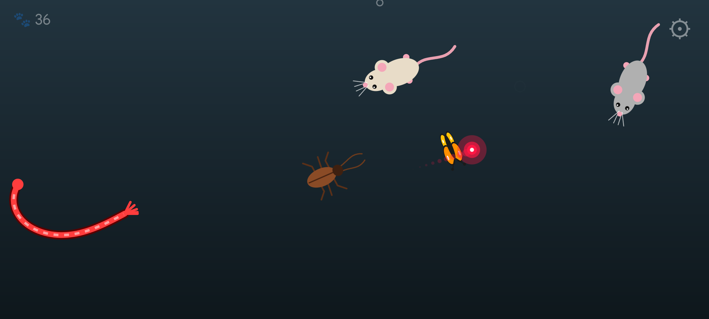

# 🐱 Cat Hunt (Кошачья охота)

[](https://github.com/Xtratter/cat-hunt/actions/workflows/build.yml)

[Русский](README.ru.md) · **English**

An Android game for cats. Mice and a cockroach run across the screen, a string wriggles,
a butterfly flutters, a fish swims and a laser dot zips around. Sounds that attract cats play,
and when the cat catches its prey, there is a flash and a burst of sparks.



## Download

Ready-made APKs are on the [Releases](https://github.com/Xtratter/cat-hunt/releases) page. Android 8.0 or newer is required.

## How to play

- Put the phone on the floor and turn the sound up (the game uses the media volume)
- Settings menu: **press and hold ⚙** in the top right corner
- Exit: press "Back" twice
- The interface is in English and Russian and follows the system language
- To make sure the cat can't leave the game, turn on "App pinning" in the Android settings

## For developers

- [Build and release guide](docs/GUIDE.en.md) ([Russian](docs/GUIDE.md))
- [Changelog](CHANGELOG.md)

```sh
./gradlew assembleDebug
# → app/build/outputs/apk/debug/app-debug.apk
```

You need JDK 17 and the Android SDK (platform 35, build-tools 35.0.0).

## License

[GNU GPL v3.0 or later](LICENSE). You are free to use and modify the code,
but derived programs must also be distributed as open source under the GPL.
